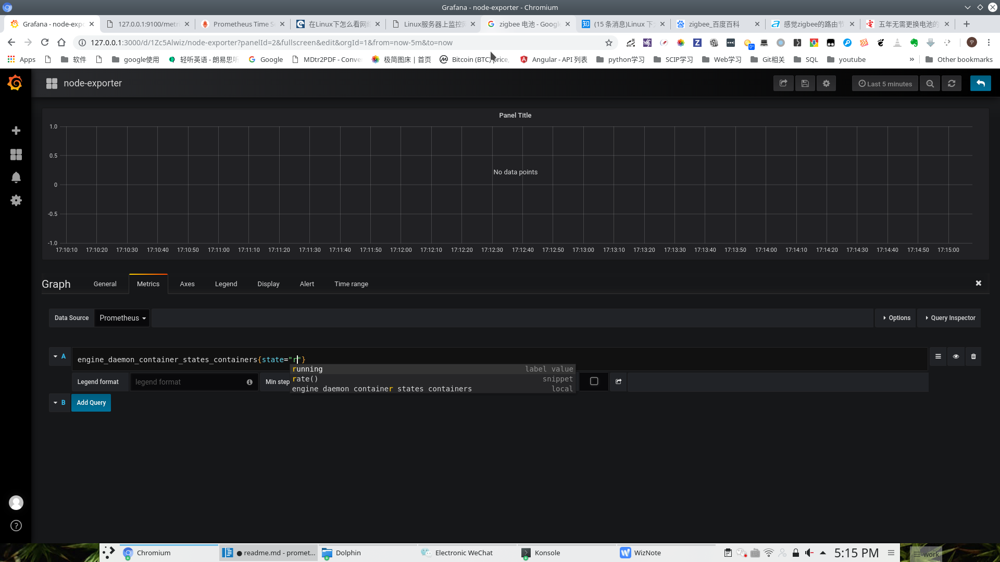

## Usage
- 1 更改docker配置```/etc/docker/daemon.json```,增加

    ```
    {
    
    "metrics-addr" : "0.0.0.0:9323",
    "experimental" : true
    }
    ```
    开启docker metrics设置
- 2 获取自身ip地址
    ```
    ip addr
    ```
    将ip地址填入```../config/prometheus/prometheus-docker.yml```文件下的docker相关的```targets```一栏，如本地ip为```192.168.43.87```，更改prometheus配置文件
    ```
    - job_name: 'docker'
         # metrics_path defaults to '/metrics'
         # scheme defaults to 'http'.

    static_configs:
      - targets: ['192.168.43.87:9323']
    ```
    注：*因为docker和prometheus在本机同时测试，要确保docker的域名能被prometheus访问到，所以有以上ip配置，真正部署环境时不用如此复杂,只需填入0.0.0.0:9323*
- 2.1 设置防火墙
  - 允许端口访问
    ```firewall-cmd --zone=public --add-port=9323/tcp --permanent```
  - 允许http 协议```firewall-cmd --zone=public --add-service=http --permanent```
  - 重载防火墙设置 ```firewall-cmd --reload```    

- 3 在```config```文件夹下通过docker-compose启动相关容器，包括grafana、prometheus、node-exporter，
    ```
    docker-compose up
    ```
    其中[node-exporter](http://127.0.0.1:9100/metrics)为节点硬件相关信息，[docker](http://127.0.0.1:9323/metrics)为容器相关信息
- 4 打开[grafana](http://127.0.0.1:3000/)页面，在数据源处选择prometheus，配置prometheus地址为docker网络中prometheus地址```http://prometheus:9090```
- 5 新建页面，配置prometheus相关参数（具体配置步骤大致与influxdb相同）
- 6 配置界面如图 
